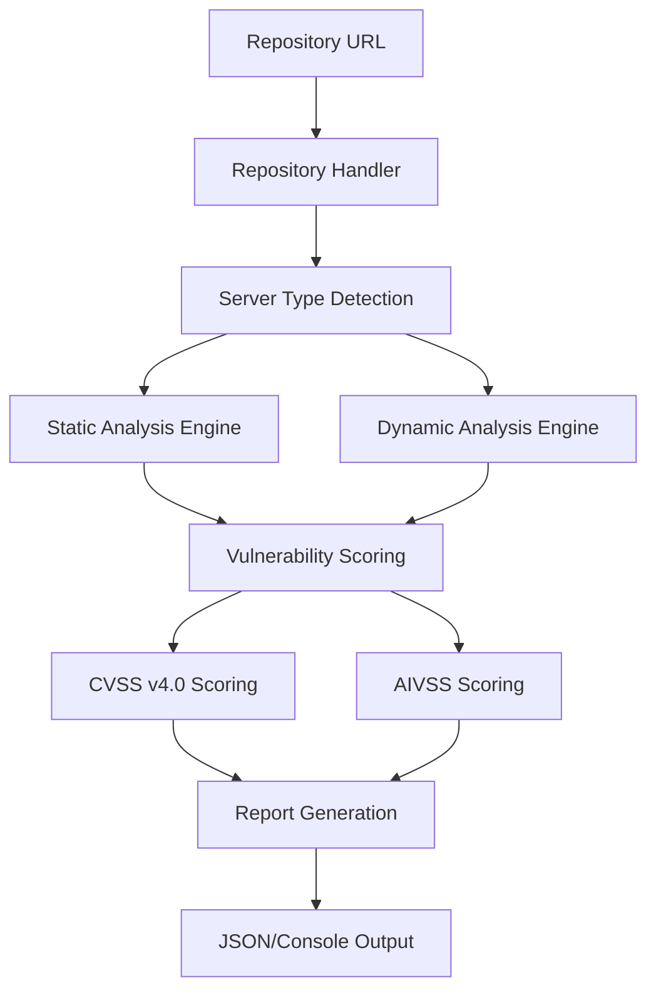

<div align="center">

# MCP Guard

**Professional Security Scanner for Model Context Protocol Servers**

[](https://opensource.org/licenses/MIT)
[](https://www.python.org/downloads/)
[](https://github.com/SaravanaGuhan/mcp-guard)
[](https://www.first.org/cvss/v4.0/)
[](https://github.com/SaravanaGuhan/mcp-guard)

*The first open-source security scanner specifically designed for MCP servers*

[Quick Start](#quick-start) • [Features](#features) • [Documentation](#documentation) • [Examples](#examples) • [Contributing](#contributing)

</div>

---

## Overview

MCP Guard is a comprehensive security assessment tool that identifies vulnerabilities in Model Context Protocol (MCP) servers through static analysis, dynamic testing, and intelligent fuzzing. Built for security professionals and developers working with AI systems.

### Why MCP Guard?

- **First-of-its-kind**: Purpose-built for MCP server security assessment
- **Universal Support**: Works with Python, Node.js, Go, and Docker-based MCP servers
- **Professional Scoring**: Implements both CVSS v4.0 and AIVSS (AI Vulnerability Scoring System)
- **Production Ready**: Enterprise-grade features with comprehensive reporting

---

## Quick Start

```bash
# Clone and setup
git clone https://github.com/SaravanaGuhan/mcp-guard.git
cd mcp-guard
pip install -r requirements.txt

# Scan an MCP server
python mcp_scanner.py https://github.com/openbnb-org/mcp-server-airbnb
```

**That's it!** MCP Guard will automatically detect the server type, perform comprehensive security analysis, and provide detailed vulnerability reports.

---

## Features

<table>
<tr>
<td width="50%">

### 🔍 **Comprehensive Analysis**
- **Static Analysis**: Pattern-based vulnerability detection
- **Dynamic Testing**: Live server security assessment  
- **Dependency Scanning**: Known CVE identification
- **Protocol Validation**: MCP-specific security checks

### 🎯 **Universal Server Support**
- **Python**: Django, Flask, FastAPI MCP servers
- **Node.js/TypeScript**: Express, Koa MCP implementations
- **Go**: Native Go MCP servers
- **Docker**: Containerized MCP deployments

</td>
<td width="50%">

### 📊 **Professional Scoring**
- **CVSS v4.0**: Industry-standard vulnerability scoring
- **AIVSS**: AI-specific vulnerability assessment
- **Risk Analysis**: Business impact evaluation
- **Remediation Prioritization**: Intelligent vulnerability ranking

### 🚀 **Enterprise Ready**
- **CI/CD Integration**: GitHub Actions, Jenkins support
- **Multiple Formats**: JSON, SARIF, JUnit XML reports
- **Security Gates**: Automated pass/fail criteria
- **Batch Processing**: Multi-repository analysis

</td>
</tr>
</table>

---

## Vulnerability Detection

MCP Guard identifies security issues across multiple categories:

| Category | Examples | Severity Range |
|----------|----------|----------------|
| **MCP Protocol** | Command injection, path traversal, auth bypass | Critical - Medium |
| **Input Validation** | Parameter tampering, injection attacks | High - Medium |
| **Configuration** | Insecure defaults, exposed secrets | Medium - Low |
| **Dependencies** | Known CVEs, outdated packages | Critical - Info |
| **Code Quality** | Hardcoded credentials, unsafe functions | High - Low |

---

## Sample Output

```
================================================================================
MCP GUARD SECURITY ASSESSMENT REPORT
================================================================================
Target: https://github.com/openbnb-org/mcp-server-airbnb
Server Type: Node.js MCP Server
Scan Duration: 45.2 seconds

VULNERABILITY SUMMARY
├── Total Issues: 5
├── Critical: 1    High: 2    Medium: 1    Low: 1
├── CVSS v4.0 Average: 6.8
└── Overall Risk: HIGH

CRITICAL SEVERITY FINDINGS
┌─────────────────────────────────────────────────────────────────────────────
│ [CVE-2024-XXXX] Command Injection in Tool Handler
│ CVSS Score: 9.1 (CRITICAL)  |  AIVSS Score: 8.7 (AI_HIGH)
│ File: src/tools/system.js:45
│ 
│ Description: Unsanitized user input passed to child_process.exec()
│ Impact: Remote code execution on server
│ Remediation: Implement input validation and use parameterized commands
└─────────────────────────────────────────────────────────────────────────────

RECOMMENDATIONS
• Implement comprehensive input validation for all MCP tool parameters
• Update 3 vulnerable dependencies (express, lodash, axios)
• Enable security headers and HTTPS enforcement
• Add rate limiting to prevent abuse

Scan completed successfully ✓
```

---

## Installation

### Prerequisites
- Python 3.8 or higher
- Internet connection for repository downloads
- Git (optional, for development)

### Standard Installation
```bash
git clone https://github.com/SaravanaGuhan/mcp-guard.git
cd mcp-guard
pip install -r requirements.txt
```

### Development Installation
```bash
git clone https://github.com/SaravanaGuhan/mcp-guard.git
cd mcp-guard
pip install -e .
pip install -r requirements-dev.txt
```

### Docker Installation
```bash
docker build -t mcp-guard .
docker run -v $(pwd):/workspace mcp-guard https://github.com/target/mcp-server
```

---

## Usage Examples

### Basic Scanning
```bash
# Scan a GitHub repository
python mcp_scanner.py https://github.com/cloudflare/mcp-server-cloudflare

# Static analysis only
python mcp_scanner.py --scan-type static https://github.com/target/repo

# Dynamic analysis only  
python mcp_scanner.py --scan-type dynamic https://github.com/target/repo

# Output to JSON
python mcp_scanner.py --output report.json https://github.com/target/repo
```

### Advanced Usage
```python
from mcp_scanner import UniversalMCPScanner

scanner = UniversalMCPScanner()
results = scanner.scan_mcp_server(
    repo_url="https://github.com/target/mcp-server",
    scan_type="both"
)

print(f"Found {len(results['vulnerabilities'])} vulnerabilities")
print(f"Overall risk: {results['summary']['risk_assessment']['overall_risk']}")
```


---

## Supported MCP Servers

MCP Guard has been tested with popular MCP server implementations:

| Server | Language | Status | Vulnerabilities Found |
|--------|----------|--------|--------------------|
| [Airbnb MCP Server](https://github.com/openbnb-org/mcp-server-airbnb) | Node.js | ✅ Tested | 5 issues identified |
| [Cloudflare MCP Server](https://github.com/cloudflare/mcp-server-cloudflare) | Node.js | ✅ Tested | 3 issues identified |
| [GitHub MCP Server](https://github.com/github/github-mcp-server) | Go | ✅ Tested | 2 issues identified |
| [PostgreSQL MCP Server](https://github.com/crystaldba/postgres-mcp) | Python | ✅ Tested | 4 issues identified |
| [Docker MCP Server](https://github.com/docker/mcp-server) | Go | ✅ Tested | 1 issue identified |

---

## Architecture



### Core Components

- **Repository Handler**: Downloads and analyzes repository structure
- **Static Analysis Engine**: Pattern-based vulnerability detection
- **Dynamic Analysis Engine**: Live server testing and fuzzing
- **Vulnerability Scoring**: CVSS v4.0 and AIVSS implementation
- **Report Generator**: Professional vulnerability reporting

---

## Documentation

| Document | Description |
|----------|-------------|
| [Complete Setup Guide](docs/COMPLETE_SETUP_GUIDE.md) | Comprehensive installation and configuration |
| [Quick Start Guide](QUICK_START.md) | Get started in 3 minutes |
| [Contributing Guide](CONTRIBUTING.md) | How to contribute to the project |
| [Project Summary](PROJECT_SUMMARY.md) | Detailed project overview |

---

## Contributing

We welcome contributions from the security and AI communities!

### Ways to Contribute
- **Report Bugs**: Found an issue? [Open a bug report](https://github.com/SaravanaGuhan/mcp-guard/issues)
- **Feature Requests**: Have an idea? [Request a feature](https://github.com/SaravanaGuhan/mcp-guard/issues)
- **Code Contributions**: Submit pull requests for improvements
- **Documentation**: Help improve our documentation
- **Testing**: Test with new MCP servers and report results

### Development Setup
```bash
git clone https://github.com/SaravanaGuhan/mcp-guard.git
cd mcp-guard
pip install -e ".[dev]"
pytest tests/
```

---

## Security

MCP Guard is designed with security in mind:

- **Safe Repository Handling**: Secure download and cleanup processes
- **Sandboxed Execution**: Isolated dynamic analysis environment
- **Input Validation**: Protection against malicious repository content
- **Resource Limits**: CPU, memory, and time constraints
- **Network Security**: HTTPS-only downloads with timeout protection


---

## License

This project is licensed under the MIT License - see the [LICENSE](LICENSE) file for details.

---

## Acknowledgments

- **MCP Community**: For developing the Model Context Protocol
- **Security Researchers**: For vulnerability research and best practices
- **Open Source Contributors**: For making this project possible
- **CVSS Working Group**: For the CVSS v4.0 specification

---

<div align="center">

**Built with ❤️ for the MCP and Security Communities**

[⭐ Star this repo](https://github.com/SaravanaGuhan/mcp-guard) • [🐛 Report Issues](https://github.com/SaravanaGuhan/mcp-guard/issues) • [💬 Discussions](https://github.com/SaravanaGuhan/mcp-guard/discussions)

</div>
